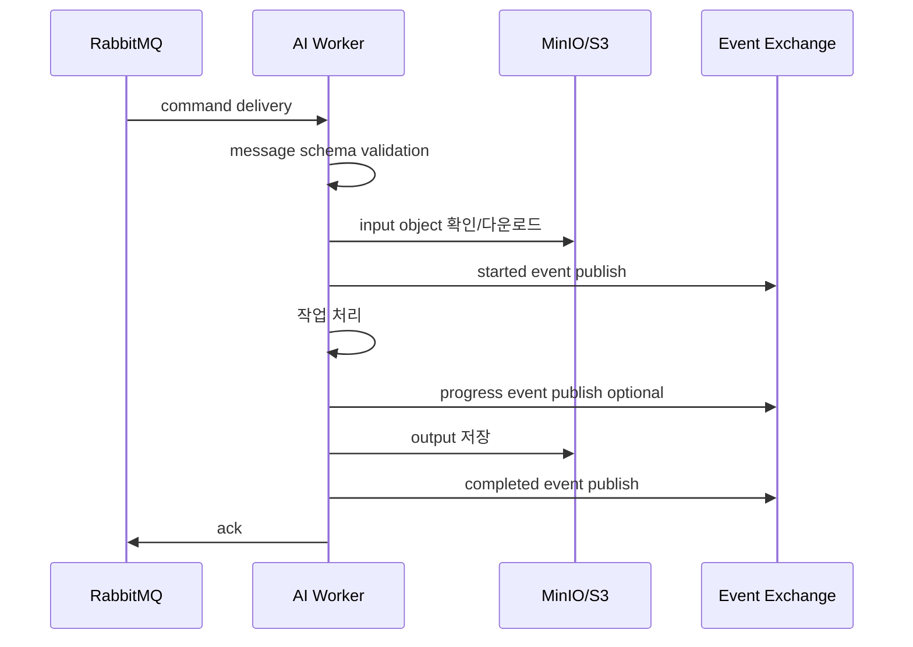
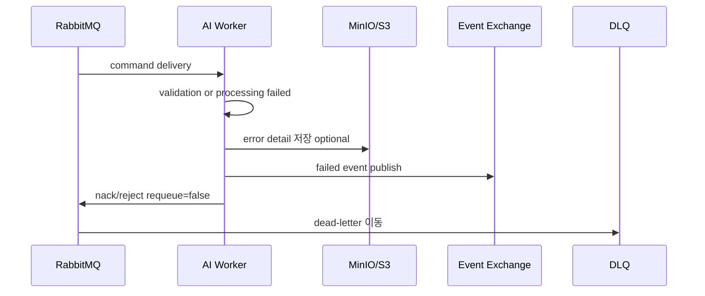
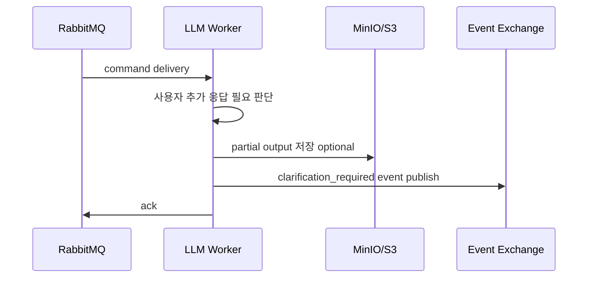

# RabbitMQ AI 명세

상태: AI

# AI Worker 개발자용 RabbitMQ 구현 명세서

## 0. 문서 목적

이 문서는 **Python 기반 AI Worker 개발자가 이 문서만 보고 Worker를 구현할 수 있도록 하기 위한 계약서**다.

중요한 기준은 다음이다.

```
Worker는 DB에 접근하지 않는다.
Worker는 BE API를 직접 호출하지 않는다.
Worker는 다음 Worker를 직접 호출하지 않는다.
Worker는 command queue에서 command를 consume하고, 작업 결과를 event exchange에 publish한다.
```

---

# 1. AI Worker 개발자가 알아야 할 핵심 요약

## 1.1 Worker가 하는 일

Worker는 RabbitMQ command queue에서 메시지를 받아 실제 AI/IFC 작업을 수행한다.

```
command consume
→ message validation
→ Storage input 읽기
→ 작업 실행
→ Storage output 저장
→ event publish
→ ack 또는 nack/reject
```

Worker가 해야 하는 일은 다음과 같다.

| 역할 | 설명 |
| --- | --- |
| command consume | 자신의 command queue에서 메시지 수신 |
| message validation | 필수 필드, schemaVersion, commandType 검증 |
| input 확인 | command.input에 있는 storage_url에서 파일 확인 |
| 작업 수행 | LLM 추론, SD 렌더링, IFC 생성/수정 |
| output 저장 | command.expectedOutput에 지정된 storage_url에 저장 |
| event publish | completed / failed / progress / clarification_required 발행 |
| ack/nack 처리 | event publish 성공 후 ack 또는 nack/reject |

---

## 1.2 Worker가 절대 하면 안 되는 일

| 금지 사항 | 이유 |
| --- | --- |
| DB 접근 | DB 정합성은 BE가 관리 |
| BE API 직접 호출 | 모든 결과는 RabbitMQ event로만 전달 |
| 다른 Worker 직접 호출 | 단계 전환은 BE Orchestrator가 담당 |
| ARTIFACTS 생성 | artifact 등록은 BE 책임 |
| REVISIONS 생성 | revision 생성은 BE 책임 |
| JOBS/JOB_STEPS 수정 | job 상태 관리는 BE 책임 |
| RabbitMQ 메시지에 파일 본문 포함 | 큰 파일은 Storage에 저장하고 URL만 전달 |
| 임의 output path 생성 | output path는 command.expectedOutput 기준 사용 |

---

## 1.3 BE와 Worker의 책임 경계

| 구분 | BE | Worker |
| --- | --- | --- |
| 사용자 요청 수신 | O | X |
| 권한 확인 | O | X |
| project lock | O | X |
| JOBS 생성 | O | X |
| JOB_STEPS 생성 | O | X |
| command 발행 | O | X |
| command consume | X | O |
| AI/IFC 작업 실행 | X | O |
| Storage input 읽기 | 필요 시 검증 | O |
| Storage output 저장 | X | O |
| event 발행 | X | O |
| event consume | O | X |
| DB 업데이트 | O | X |
| revision 생성 | O | X |
| artifact 등록 | O | X |
| WebSocket 알림 | O | X |
| 다음 Worker 실행 판단 | O | X |

---

# 2. 전체 Worker 처리 흐름



실패 시:



Clarification 필요 시:



---

# 3. RabbitMQ 연결/구독 기준

## 3.1 Exchange

| Exchange | 용도 | Worker 사용 |
| --- | --- | --- |
| `batang.commands.exchange` | BE가 command 발행 | Worker는 직접 publish하지 않음 |
| `batang.events.exchange` | Worker가 event 발행 | Worker가 publish |
| `batang.dlx.exchange` | 실패 command 격리 | RabbitMQ가 사용 |

---

## 3.2 Worker별 Consume Queue

| Worker | Consume Queue | Command Routing Key |
| --- | --- | --- |
| 2D LLM Worker | `batang.2d-llm.command.queue` | `command.2d-llm.generate` |
| 3D LLM Worker | `batang.3d-llm.command.queue` | `command.3d-llm.generate` |
| Stable Diffusion Worker | `batang.sd-render.command.queue` | `command.sd-render.generate` |
| Bubble Diagram to IFC Worker | `batang.ifc-generate.command.queue` | `command.ifc-generate.from-bubble` |
| IFC Edit Engine Worker | `batang.ifc-edit.command.queue` | `command.ifc-edit.apply` |

---

## 3.3 Worker별 Publish Event Routing Key

| Worker | Event Routing Key |
| --- | --- |
| 2D LLM Worker | `event.2d-llm.started` |
| 2D LLM Worker | `event.2d-llm.progress` |
| 2D LLM Worker | `event.2d-llm.completed` |
| 2D LLM Worker | `event.2d-llm.failed` |
| 2D LLM Worker | `event.2d-llm.clarification_required` |
| 3D LLM Worker | `event.3d-llm.started` |
| 3D LLM Worker | `event.3d-llm.progress` |
| 3D LLM Worker | `event.3d-llm.completed` |
| 3D LLM Worker | `event.3d-llm.failed` |
| 3D LLM Worker | `event.3d-llm.clarification_required` |
| Stable Diffusion Worker | `event.sd-render.started` |
| Stable Diffusion Worker | `event.sd-render.progress` |
| Stable Diffusion Worker | `event.sd-render.completed` |
| Stable Diffusion Worker | `event.sd-render.failed` |
| Bubble Diagram to IFC Worker | `event.ifc-generate.started` |
| Bubble Diagram to IFC Worker | `event.ifc-generate.progress` |
| Bubble Diagram to IFC Worker | `event.ifc-generate.completed` |
| Bubble Diagram to IFC Worker | `event.ifc-generate.failed` |
| IFC Edit Engine Worker | `event.ifc-edit.started` |
| IFC Edit Engine Worker | `event.ifc-edit.progress` |
| IFC Edit Engine Worker | `event.ifc-edit.completed` |
| IFC Edit Engine Worker | `event.ifc-edit.failed` |

---

## 3.4 Prefetch Count 권장

| Worker | MVP 권장 prefetch | 이유 |
| --- | --- | --- |
| 2D LLM Worker | 1 | LLM 추론 비용/시간 큼 |
| 3D LLM Worker | 1 | LLM 추론 비용/시간 큼 |
| Stable Diffusion Worker | 1 | GPU 자원 사용 |
| Bubble Diagram to IFC Worker | 1~2 | IFC 생성 작업 무거울 수 있음 |
| IFC Edit Engine Worker | 1 | revision 생성과 연결되는 중요 작업 |

MVP에서는 모든 Worker를 `prefetch_count = 1`로 시작해도 된다.
처리량이 부족하면 Worker replica 수를 늘리는 방식이 더 안전하다.

---

# 4. Storage 사용 규칙

## 4.1 기본 원칙

```
input은 command.input의 storage_url에서 읽는다.
output은 command.expectedOutput의 storage_url에 저장한다.
Worker는 임의 output 경로를 만들지 않는다.
```

---

## 4.2 Worker가 지켜야 할 것

| 규칙 | 설명 |
| --- | --- |
| input URL 검증 | command.input에 필요한 storage_url이 있는지 확인 |
| input 존재 확인 | Storage에 실제 object가 있는지 확인 |
| output path 준수 | command.expectedOutput에 지정된 경로 사용 |
| 파일 본문 전송 금지 | RabbitMQ message에는 파일 본문 포함 금지 |
| output metadata 포함 | completed event.output에 저장 경로와 metadata 포함 |
| error detail 저장 가능 | 긴 에러 로그는 Storage에 저장 후 URL만 event에 포함 |

---

## 4.3 Storage 경로 예시

```
jobs/{jobId}/steps/{stepNo}/edit-plan.json
jobs/{jobId}/steps/{stepNo}/3d-plan.json
jobs/{jobId}/steps/{stepNo}/draft-plan.json
jobs/{jobId}/steps/{stepNo}/validation-report.json
jobs/{jobId}/steps/{stepNo}/error-detail.json

projects/{projectId}/revisions/{revisionId}/model.ifc
projects/{projectId}/revisions/{revisionId}/scene-ifc.json
projects/{projectId}/renders/{artifactId}.png
```

---

# 5. Worker별 구현 명세

## 5.1 2D LLM Worker

### 역할

2D LLM Worker는 사용자의 자연어 요청과 현재 2D scene 또는 IFC 관련 context를 바탕으로 **2D 계획, 수정 계획, IFC Edit Plan**을 생성한다.

### Consume

| 항목 | 값 |
| --- | --- |
| Queue | `batang.2d-llm.command.queue` |
| Command Routing Key | `command.2d-llm.generate` |
| Command Type | `TWO_D_LLM_GENERATE` |

### Input

| 필드 | 설명 |
| --- | --- |
| `input.sourceSceneStorageUrl` | 현재 2D scene JSON |
| `input.sourceIfcStorageUrl` | 필요 시 현재 IFC |
| `payload.userInstruction` | 사용자 자연어 요청 |
| `payload.outputFormat` | `IFC_EDIT_PLAN`, `TWO_D_PLAN`, `BUBBLE_DIAGRAM_PLAN` 등 |
| `payload.clarificationAnswers` | 사용자 추가 답변이 있는 경우 |

### Output

| Output | 저장 위치 |
| --- | --- |
| `edit-plan.json` | `expectedOutput.editPlanStorageUrl` |
| `draft-plan.json` | clarification 전 partial output이 있을 때 |
| `bubble-plan.json` | 버블 다이어그램 계획인 경우 |

### Completed Event

| 항목 | 값 |
| --- | --- |
| Routing Key | `event.2d-llm.completed` |
| Event Type | `TWO_D_LLM_COMPLETED` |
| 필수 output | `editPlanStorageUrl` 또는 `planStorageUrl` |

### Clarification Required Event

| 항목 | 값 |
| --- | --- |
| Routing Key | `event.2d-llm.clarification_required` |
| Event Type | `TWO_D_LLM_CLARIFICATION_REQUIRED` |
| 사용 조건 | 사용자 의도/공간 방향/수정 범위가 모호한 경우 |

### Failed Event

| 항목 | 값 |
| --- | --- |
| Routing Key | `event.2d-llm.failed` |
| Event Type | `TWO_D_LLM_FAILED` |

---

## 5.2 3D LLM Worker

### 역할

3D LLM Worker는 3D 공간, 매스, 입면, 재료, 렌더링 의도 등을 해석해 **3D 계획, IFC Edit Plan, Stable Diffusion Prompt** 등을 생성한다.

### Consume

| 항목 | 값 |
| --- | --- |
| Queue | `batang.3d-llm.command.queue` |
| Command Routing Key | `command.3d-llm.generate` |
| Command Type | `THREE_D_LLM_GENERATE` |

### Input

| 필드 | 설명 |
| --- | --- |
| `input.sourceIfcStorageUrl` | 현재 IFC |
| `input.sourceSceneStorageUrl` | 현재 3D scene JSON |
| `payload.userInstruction` | 사용자 자연어 요청 |
| `payload.outputFormat` | `THREE_D_EDIT_PLAN`, `SD_RENDER_PROMPT`, `IFC_EDIT_PLAN` 등 |
| `payload.clarificationAnswers` | 사용자 추가 답변 |

### Output

| Output | 저장 위치 |
| --- | --- |
| `3d-plan.json` | `expectedOutput.threeDPlanStorageUrl` |
| `render-prompt.json` | `expectedOutput.renderPromptStorageUrl` |
| `edit-plan.json` | IFC 수정으로 이어지는 경우 |

### Completed Event

| 항목 | 값 |
| --- | --- |
| Routing Key | `event.3d-llm.completed` |
| Event Type | `THREE_D_LLM_COMPLETED` |

### Clarification Required Event

3D는 표현이 모호할 가능성이 높기 때문에 clarification을 지원한다.

예:

```
사용자: 입면을 고급스럽게 해줘
3D LLM: 어떤 방향의 고급스러움을 원하시나요?
```

| 항목 | 값 |
| --- | --- |
| Routing Key | `event.3d-llm.clarification_required` |
| Event Type | `THREE_D_LLM_CLARIFICATION_REQUIRED` |

### Failed Event

| 항목 | 값 |
| --- | --- |
| Routing Key | `event.3d-llm.failed` |
| Event Type | `THREE_D_LLM_FAILED` |

---

## 5.3 Stable Diffusion Worker

### 역할

Stable Diffusion Worker는 입력 prompt, camera state, reference image 등을 바탕으로 최종 렌더 이미지를 생성한다.

### Consume

| 항목 | 값 |
| --- | --- |
| Queue | `batang.sd-render.command.queue` |
| Command Routing Key | `command.sd-render.generate` |
| Command Type | `SD_RENDER_GENERATE` |

### Input

| 필드 | 설명 |
| --- | --- |
| `input.sourceIfcStorageUrl` | 기준 IFC |
| `input.cameraStateStorageUrl` | 카메라 상태 |
| `input.referenceImageStorageUrl` | 선택 입력 |
| `payload.prompt` | 렌더링 prompt |
| `payload.width` | 이미지 width |
| `payload.height` | 이미지 height |
| `payload.style` | 렌더 스타일 |

### Output

| Output | 저장 위치 |
| --- | --- |
| render image | `expectedOutput.outputImageStorageUrl` |

### Completed Event

| 항목 | 값 |
| --- | --- |
| Routing Key | `event.sd-render.completed` |
| Event Type | `SD_RENDER_COMPLETED` |
| 필수 output | `outputImageStorageUrl`, `mimeType`, `width`, `height` |

### Failed Event

| 항목 | 값 |
| --- | --- |
| Routing Key | `event.sd-render.failed` |
| Event Type | `SD_RENDER_FAILED` |

Stable Diffusion Worker는 기본적으로 `clarification_required`를 직접 발행하지 않는다.
prompt가 부족하면 BE 또는 LLM 단계에서 정리하는 것을 원칙으로 한다.

---

## 5.4 Bubble Diagram to IFC Worker

### 역할

Bubble Diagram to IFC Worker는 구조화된 bubble diagram JSON을 IFC 모델로 변환한다.

### Consume

| 항목 | 값 |
| --- | --- |
| Queue | `batang.ifc-generate.command.queue` |
| Command Routing Key | `command.ifc-generate.from-bubble` |
| Command Type | `IFC_GENERATE_FROM_BUBBLE` |

### Input

| 필드 | 설명 |
| --- | --- |
| `input.bubbleDiagramStorageUrl` | bubble diagram JSON |
| `payload.unit` | 단위 |
| `payload.floorCount` | 층수 |
| `payload.schemaVersion` | bubble JSON schema version |

### Output

| Output | 저장 위치 |
| --- | --- |
| IFC model | `expectedOutput.outputIfcStorageUrl` |
| scene snapshot | `expectedOutput.sceneSnapshotStorageUrl` |
| validation report | `expectedOutput.validationReportStorageUrl` |

### Completed Event

| 항목 | 값 |
| --- | --- |
| Routing Key | `event.ifc-generate.completed` |
| Event Type | `IFC_GENERATE_COMPLETED` |

### Failed Event

| 항목 | 값 |
| --- | --- |
| Routing Key | `event.ifc-generate.failed` |
| Event Type | `IFC_GENERATE_FAILED` |

Bubble Diagram to IFC Worker는 clarification을 직접 요청하지 않는다.
입력 JSON이 부족하거나 스키마가 맞지 않으면 failed event를 발행한다.

---

## 5.5 IFC Edit Engine Worker

### 역할

IFC Edit Engine Worker는 source IFC와 edit plan을 읽어 IFC 모델을 수정한다.

### Consume

| 항목 | 값 |
| --- | --- |
| Queue | `batang.ifc-edit.command.queue` |
| Command Routing Key | `command.ifc-edit.apply` |
| Command Type | `IFC_EDIT_APPLY` |

### Input

| 필드 | 설명 |
| --- | --- |
| `input.sourceIfcStorageUrl` | 수정 대상 IFC |
| `input.editPlanStorageUrl` | LLM 또는 BE가 생성한 edit plan |
| `payload.operationMode` | `APPLY_EDIT_PLAN` 등 |
| `payload.validateIfcAfterEdit` | 수정 후 IFC 검증 여부 |

### Output

| Output | 저장 위치 |
| --- | --- |
| output IFC | `expectedOutput.outputIfcStorageUrl` |
| scene snapshot | `expectedOutput.sceneSnapshotStorageUrl` |
| validation report | `expectedOutput.validationReportStorageUrl` |

### Completed Event

| 항목 | 값 |
| --- | --- |
| Routing Key | `event.ifc-edit.completed` |
| Event Type | `IFC_EDIT_COMPLETED` |
| 필수 output | output IFC, scene snapshot, validation report |

### Failed Event

| 항목 | 값 |
| --- | --- |
| Routing Key | `event.ifc-edit.failed` |
| Event Type | `IFC_EDIT_FAILED` |

IFC Edit Engine Worker는 clarification을 직접 요청하지 않는다.
edit plan이 부족하거나 잘못되었으면 failed event를 발행한다.

---

# 6. Message Schema 예시

## 6.1 Command 공통 Schema

```json
{
  "messageId": "msg-uuid",
  "schemaVersion": 1,
  "messageType": "COMMAND",
  "commandType": "IFC_EDIT_APPLY",
  "routingKey": "command.ifc-edit.apply",

  "jobId": "job-uuid",
  "jobStepId": "job-step-uuid",
  "stepNo": 2,
  "totalSteps": 2,

  "projectId": "project-uuid",
  "requestedBy": "user-uuid",

  "sourceRevisionId": "source-revision-uuid",
  "sourceSceneStateId": "scene-state-uuid",
  "sourceSceneType": "IFC_MODEL",

  "targetRevisionId": "target-revision-uuid",
  "expectedOutputArtifactId": "artifact-uuid",

  "input": {
    "sourceStorageUrl": "s3://..."
  },

  "expectedOutput": {
    "outputStorageUrl": "s3://..."
  },

  "payload": {},

  "attemptNo": 1,
  "maxAttempts": 3,
  "idempotencyKey": "job-uuid:step-2:ifc-edit",
  "correlationId": "request-uuid",
  "createdAt": "2026-04-26T12:00:00+09:00"
}
```

---

## 6.2 Event 공통 Schema

```json
{
  "eventId": "event-uuid",
  "schemaVersion": 1,
  "messageType": "EVENT",
  "eventType": "IFC_EDIT_COMPLETED",
  "routingKey": "event.ifc-edit.completed",

  "jobId": "job-uuid",
  "jobStepId": "job-step-uuid",
  "stepNo": 2,
  "totalSteps": 2,

  "projectId": "project-uuid",
  "workerType": "IFC_EDIT",
  "workerId": "ifc-edit-worker-1",

  "sourceRevisionId": "source-revision-uuid",
  "targetRevisionId": "target-revision-uuid",
  "outputArtifactId": "artifact-uuid",

  "status": "COMPLETED",
  "progress": 100,

  "output": {},
  "error": null,

  "idempotencyKey": "job-uuid:step-2:ifc-edit",
  "correlationId": "request-uuid",
  "occurredAt": "2026-04-26T12:01:00+09:00"
}
```

---

## 6.3 2D LLM Command 예시

```json
{
  "messageId": "msg-2d-001",
  "schemaVersion": 1,
  "messageType": "COMMAND",
  "commandType": "TWO_D_LLM_GENERATE",
  "routingKey": "command.2d-llm.generate",

  "jobId": "job-123",
  "jobStepId": "step-001",
  "stepNo": 1,
  "totalSteps": 2,

  "projectId": "project-456",
  "requestedBy": "user-789",

  "sourceRevisionId": "rev-010",
  "sourceSceneStateId": "scene-010",
  "sourceSceneType": "FLOOR_PLAN_2D",

  "input": {
    "sourceSceneStorageUrl": "s3://batang/projects/project-456/scenes/scene-010.json"
  },

  "expectedOutput": {
    "editPlanStorageUrl": "s3://batang/jobs/job-123/steps/1/edit-plan.json"
  },

  "payload": {
    "userInstruction": "거실을 넓히고 외벽 일부를 유리로 바꿔줘",
    "outputFormat": "IFC_EDIT_PLAN",
    "language": "ko"
  },

  "attemptNo": 1,
  "maxAttempts": 3,
  "idempotencyKey": "job-123:step-1:2d-llm",
  "correlationId": "req-abc"
}
```

---

## 6.4 2D LLM Completed Event 예시

```json
{
  "eventId": "evt-2d-001",
  "schemaVersion": 1,
  "messageType": "EVENT",
  "eventType": "TWO_D_LLM_COMPLETED",
  "routingKey": "event.2d-llm.completed",

  "jobId": "job-123",
  "jobStepId": "step-001",
  "stepNo": 1,
  "totalSteps": 2,

  "projectId": "project-456",
  "workerType": "TWO_D_LLM",
  "workerId": "2d-llm-worker-1",

  "status": "COMPLETED",
  "progress": 100,

  "output": {
    "editPlanStorageUrl": "s3://batang/jobs/job-123/steps/1/edit-plan.json",
    "summary": "거실 확장 및 외벽 유리 변경 계획 생성",
    "recommendedNextCommand": "command.ifc-edit.apply"
  },

  "error": null,
  "idempotencyKey": "job-123:step-1:2d-llm",
  "correlationId": "req-abc",
  "occurredAt": "2026-04-26T12:01:00+09:00"
}
```

`recommendedNextCommand`는 참고값이다.
다음 command 발행 여부는 BE가 결정한다.

---

## 6.5 2D LLM Clarification Required Event 예시

```json
{
  "eventId": "evt-2d-clarify-001",
  "schemaVersion": 1,
  "messageType": "EVENT",
  "eventType": "TWO_D_LLM_CLARIFICATION_REQUIRED",
  "routingKey": "event.2d-llm.clarification_required",

  "jobId": "job-123",
  "jobStepId": "step-001",
  "stepNo": 1,
  "totalSteps": 2,

  "projectId": "project-456",
  "workerType": "TWO_D_LLM",
  "workerId": "2d-llm-worker-1",

  "status": "WAITING_CLARIFICATION",
  "progress": 30,

  "clarification": {
    "question": "거실을 어느 방향으로 확장할까요?",
    "reason": "요청에는 거실 확장 방향이 명시되어 있지 않습니다.",
    "required": true,
    "expectedAnswerType": "SINGLE_CHOICE",
    "options": [
      {
        "value": "NORTH",
        "label": "북쪽으로 확장"
      },
      {
        "value": "SOUTH",
        "label": "남쪽으로 확장"
      },
      {
        "value": "TOWARD_CORRIDOR",
        "label": "복도 방향으로 확장"
      }
    ]
  },

  "partialOutput": {
    "draftPlanStorageUrl": "s3://batang/jobs/job-123/steps/1/draft-plan.json"
  },

  "output": null,
  "error": null,

  "idempotencyKey": "job-123:step-1:2d-llm:clarification-1",
  "correlationId": "req-abc",
  "occurredAt": "2026-04-26T12:01:00+09:00"
}
```

---

## 6.6 3D LLM Command 예시

```json
{
  "messageId": "msg-3d-001",
  "schemaVersion": 1,
  "messageType": "COMMAND",
  "commandType": "THREE_D_LLM_GENERATE",
  "routingKey": "command.3d-llm.generate",

  "jobId": "job-300",
  "jobStepId": "step-300-1",
  "stepNo": 1,
  "totalSteps": 1,

  "projectId": "project-456",
  "requestedBy": "user-789",

  "sourceRevisionId": "rev-011",
  "sourceSceneStateId": "scene-011",
  "sourceSceneType": "IFC_MODEL",

  "input": {
    "sourceIfcStorageUrl": "s3://batang/projects/project-456/revisions/rev-011/model.ifc"
  },

  "expectedOutput": {
    "threeDPlanStorageUrl": "s3://batang/jobs/job-300/steps/1/3d-plan.json"
  },

  "payload": {
    "userInstruction": "입면을 더 고급스럽게 바꿔줘",
    "outputFormat": "THREE_D_EDIT_PLAN",
    "language": "ko"
  },

  "attemptNo": 1,
  "maxAttempts": 3,
  "idempotencyKey": "job-300:step-1:3d-llm",
  "correlationId": "req-3d-001"
}
```

---

## 6.7 3D LLM Clarification Required Event 예시

```json
{
  "eventId": "evt-3d-clarify-001",
  "schemaVersion": 1,
  "messageType": "EVENT",
  "eventType": "THREE_D_LLM_CLARIFICATION_REQUIRED",
  "routingKey": "event.3d-llm.clarification_required",

  "jobId": "job-300",
  "jobStepId": "step-300-1",
  "stepNo": 1,
  "totalSteps": 1,

  "projectId": "project-456",
  "workerType": "THREE_D_LLM",
  "workerId": "3d-llm-worker-1",

  "status": "WAITING_CLARIFICATION",
  "progress": 20,

  "clarification": {
    "question": "어떤 방향의 고급스러운 입면을 원하시나요?",
    "reason": "고급스럽다는 표현이 구체적인 재료, 스타일, 형태를 특정하지 않습니다.",
    "required": true,
    "expectedAnswerType": "SINGLE_CHOICE",
    "options": [
      {
        "value": "MINIMAL",
        "label": "미니멀한 고급감"
      },
      {
        "value": "STONE_CLASSIC",
        "label": "석재 중심의 클래식한 입면"
      },
      {
        "value": "GLASS_CURTAINWALL",
        "label": "유리 커튼월 중심"
      },
      {
        "value": "CURVED_MASS",
        "label": "곡면 매스 강조"
      }
    ]
  },

  "partialOutput": {
    "draftPlanStorageUrl": "s3://batang/jobs/job-300/steps/1/draft-3d-plan.json"
  },

  "output": null,
  "error": null,

  "idempotencyKey": "job-300:step-1:3d-llm:clarification-1",
  "correlationId": "req-3d-001",
  "occurredAt": "2026-04-26T12:01:00+09:00"
}
```

---

## 6.8 Stable Diffusion Command 예시

```json
{
  "messageId": "msg-sd-001",
  "schemaVersion": 1,
  "messageType": "COMMAND",
  "commandType": "SD_RENDER_GENERATE",
  "routingKey": "command.sd-render.generate",

  "jobId": "job-500",
  "jobStepId": "step-500-1",
  "stepNo": 1,
  "totalSteps": 1,

  "projectId": "project-456",
  "requestedBy": "user-789",

  "sourceRevisionId": "rev-011",
  "sourceSceneStateId": "scene-011",
  "sourceSceneType": "IFC_MODEL",

  "expectedOutputArtifactId": "artifact-render-001",

  "input": {
    "sourceIfcStorageUrl": "s3://batang/projects/project-456/revisions/rev-011/model.ifc",
    "cameraStateStorageUrl": "s3://batang/projects/project-456/views/camera-001.json"
  },

  "expectedOutput": {
    "outputImageStorageUrl": "s3://batang/projects/project-456/renders/artifact-render-001.png"
  },

  "payload": {
    "prompt": "modern architectural interior, warm daylight, realistic rendering",
    "style": "ARCHITECTURAL_RENDER",
    "width": 1024,
    "height": 1024
  },

  "attemptNo": 1,
  "maxAttempts": 3,
  "idempotencyKey": "job-500:step-1:sd-render",
  "correlationId": "req-render-001"
}
```

---

## 6.9 Stable Diffusion Completed Event 예시

```json
{
  "eventId": "evt-sd-001",
  "schemaVersion": 1,
  "messageType": "EVENT",
  "eventType": "SD_RENDER_COMPLETED",
  "routingKey": "event.sd-render.completed",

  "jobId": "job-500",
  "jobStepId": "step-500-1",
  "stepNo": 1,
  "totalSteps": 1,

  "projectId": "project-456",
  "workerType": "SD_RENDER",
  "workerId": "sd-worker-1",

  "sourceRevisionId": "rev-011",
  "outputArtifactId": "artifact-render-001",

  "status": "COMPLETED",
  "progress": 100,

  "output": {
    "outputImageStorageUrl": "s3://batang/projects/project-456/renders/artifact-render-001.png",
    "mimeType": "image/png",
    "width": 1024,
    "height": 1024,
    "summary": "최종 렌더 이미지 생성 완료"
  },

  "error": null,
  "idempotencyKey": "job-500:step-1:sd-render",
  "correlationId": "req-render-001",
  "occurredAt": "2026-04-26T12:01:00+09:00"
}
```

---

## 6.10 Bubble Diagram to IFC Command 예시

```json
{
  "messageId": "msg-ifc-gen-001",
  "schemaVersion": 1,
  "messageType": "COMMAND",
  "commandType": "IFC_GENERATE_FROM_BUBBLE",
  "routingKey": "command.ifc-generate.from-bubble",

  "jobId": "job-600",
  "jobStepId": "step-600-1",
  "stepNo": 1,
  "totalSteps": 1,

  "projectId": "project-456",
  "requestedBy": "user-789",

  "sourceRevisionId": null,
  "sourceSceneStateId": "scene-bubble-001",
  "sourceSceneType": "BUBBLE_DIAGRAM",

  "targetRevisionId": "rev-001",
  "expectedOutputArtifactId": "artifact-ifc-001",

  "input": {
    "bubbleDiagramStorageUrl": "s3://batang/projects/project-456/scenes/bubble-001.json"
  },

  "expectedOutput": {
    "outputIfcStorageUrl": "s3://batang/projects/project-456/revisions/rev-001/model.ifc",
    "sceneSnapshotStorageUrl": "s3://batang/projects/project-456/revisions/rev-001/scene-ifc.json",
    "validationReportStorageUrl": "s3://batang/jobs/job-600/steps/1/validation-report.json"
  },

  "payload": {
    "unit": "METER",
    "schemaVersion": 1
  },

  "attemptNo": 1,
  "maxAttempts": 3,
  "idempotencyKey": "job-600:step-1:ifc-generate",
  "correlationId": "req-ifc-gen-001"
}
```

---

## 6.11 Bubble Diagram to IFC Completed Event 예시

```json
{
  "eventId": "evt-ifc-gen-001",
  "schemaVersion": 1,
  "messageType": "EVENT",
  "eventType": "IFC_GENERATE_COMPLETED",
  "routingKey": "event.ifc-generate.completed",

  "jobId": "job-600",
  "jobStepId": "step-600-1",
  "stepNo": 1,
  "totalSteps": 1,

  "projectId": "project-456",
  "workerType": "IFC_GENERATE",
  "workerId": "ifc-generate-worker-1",

  "sourceRevisionId": null,
  "targetRevisionId": "rev-001",
  "outputArtifactId": "artifact-ifc-001",

  "status": "COMPLETED",
  "progress": 100,

  "output": {
    "outputIfcStorageUrl": "s3://batang/projects/project-456/revisions/rev-001/model.ifc",
    "sceneSnapshotStorageUrl": "s3://batang/projects/project-456/revisions/rev-001/scene-ifc.json",
    "validationReportStorageUrl": "s3://batang/jobs/job-600/steps/1/validation-report.json",
    "summary": "Bubble Diagram 기반 IFC 생성 완료"
  },

  "error": null,
  "idempotencyKey": "job-600:step-1:ifc-generate",
  "correlationId": "req-ifc-gen-001",
  "occurredAt": "2026-04-26T12:01:00+09:00"
}
```

---

## 6.12 IFC Edit Command 예시

```json
{
  "messageId": "msg-ifc-edit-001",
  "schemaVersion": 1,
  "messageType": "COMMAND",
  "commandType": "IFC_EDIT_APPLY",
  "routingKey": "command.ifc-edit.apply",

  "jobId": "job-123",
  "jobStepId": "step-002",
  "stepNo": 2,
  "totalSteps": 2,

  "projectId": "project-456",
  "requestedBy": "user-789",

  "sourceRevisionId": "rev-010",
  "sourceSceneStateId": "scene-010",
  "sourceSceneType": "IFC_MODEL",

  "targetRevisionId": "rev-011",
  "expectedOutputArtifactId": "artifact-ifc-011",

  "input": {
    "sourceIfcStorageUrl": "s3://batang/projects/project-456/revisions/rev-010/model.ifc",
    "editPlanStorageUrl": "s3://batang/jobs/job-123/steps/1/edit-plan.json"
  },

  "expectedOutput": {
    "outputIfcStorageUrl": "s3://batang/projects/project-456/revisions/rev-011/model.ifc",
    "sceneSnapshotStorageUrl": "s3://batang/projects/project-456/revisions/rev-011/scene-ifc.json",
    "validationReportStorageUrl": "s3://batang/jobs/job-123/steps/2/validation-report.json"
  },

  "payload": {
    "operationMode": "APPLY_EDIT_PLAN",
    "createRevision": true,
    "validateIfcAfterEdit": true
  },

  "attemptNo": 1,
  "maxAttempts": 3,
  "idempotencyKey": "job-123:step-2:ifc-edit",
  "correlationId": "req-abc"
}
```

---

## 6.13 IFC Edit Completed Event 예시

```json
{
  "eventId": "evt-ifc-edit-001",
  "schemaVersion": 1,
  "messageType": "EVENT",
  "eventType": "IFC_EDIT_COMPLETED",
  "routingKey": "event.ifc-edit.completed",

  "jobId": "job-123",
  "jobStepId": "step-002",
  "stepNo": 2,
  "totalSteps": 2,

  "projectId": "project-456",
  "workerType": "IFC_EDIT",
  "workerId": "ifc-edit-worker-1",

  "sourceRevisionId": "rev-010",
  "targetRevisionId": "rev-011",
  "outputArtifactId": "artifact-ifc-011",

  "status": "COMPLETED",
  "progress": 100,

  "output": {
    "outputIfcStorageUrl": "s3://batang/projects/project-456/revisions/rev-011/model.ifc",
    "sceneSnapshotStorageUrl": "s3://batang/projects/project-456/revisions/rev-011/scene-ifc.json",
    "validationReportStorageUrl": "s3://batang/jobs/job-123/steps/2/validation-report.json",
    "changedElementIds": [
      "IfcWall-001",
      "IfcWall-002"
    ],
    "summary": "거실 확장 및 외벽 유리 변경 완료"
  },

  "error": null,
  "idempotencyKey": "job-123:step-2:ifc-edit",
  "correlationId": "req-abc",
  "occurredAt": "2026-04-26T12:01:00+09:00"
}
```

---

## 6.14 Failed Event 예시

```json
{
  "eventId": "evt-failed-001",
  "schemaVersion": 1,
  "messageType": "EVENT",
  "eventType": "IFC_EDIT_FAILED",
  "routingKey": "event.ifc-edit.failed",

  "jobId": "job-123",
  "jobStepId": "step-002",
  "stepNo": 2,
  "totalSteps": 2,

  "projectId": "project-456",
  "workerType": "IFC_EDIT",
  "workerId": "ifc-edit-worker-1",

  "status": "FAILED",
  "progress": 60,

  "output": null,

  "error": {
    "code": "IFC_VALIDATION_FAILED",
    "message": "Output IFC failed validation",
    "retryable": false,
    "clarificationPossible": false,
    "detailStorageUrl": "s3://batang/jobs/job-123/steps/2/error-detail.json"
  },

  "idempotencyKey": "job-123:step-2:ifc-edit",
  "correlationId": "req-abc",
  "occurredAt": "2026-04-26T12:01:00+09:00"
}
```

---

# 7. clarification_required 처리 기준

## 7.1 기본 원칙

`clarification_required`는 실패가 아니다.

```
clarification_required = 사용자 추가 응답이 필요해서 현재 step을 잠시 멈추는 상태
```

---

## 7.2 발행 가능한 Worker

| Worker | 발행 가능 여부 |
| --- | --- |
| 2D LLM Worker | O |
| 3D LLM Worker | O |
| Stable Diffusion Worker | 기본 X |
| Bubble Diagram to IFC Worker | X |
| IFC Edit Engine Worker | X |

---

## 7.3 clarification_required event 필수 내용

| 필드 | 설명 |
| --- | --- |
| `clarification.question` | 사용자에게 보여줄 질문 |
| `clarification.reason` | 왜 추가 응답이 필요한지 |
| `clarification.required` | 필수 답변 여부 |
| `clarification.expectedAnswerType` | `TEXT`, `SINGLE_CHOICE`, `MULTI_CHOICE`, `NUMBER` 등 |
| `clarification.options` | 선택지 |
| `partialOutput` | 중간 산출물이 있는 경우 storage URL |

---

## 7.4 처리 순서

```
1. LLM이 추가 응답 필요 판단
2. partial output이 있으면 Storage에 저장
3. clarification_required event publish
4. publisher confirm 확인
5. command ack
```

주의:

```
clarification_required는 실패가 아니므로 nack/reject 하지 않는다.
DLQ로 보내지 않는다.
사용자 답변 처리는 BE가 담당한다.
Worker는 사용자 답변을 직접 받지 않는다.
```

---

# 8. 실패 처리 기준

## 8.1 Retryable / Non-retryable 구분

| Error | retryable | 예시 |
| --- | --- | --- |
| 일시적 Storage 연결 실패 | true | MinIO timeout |
| 일시적 LLM API timeout | true | model server timeout |
| GPU memory 일시 부족 | true | SD worker resource busy |
| command schema 오류 | false | 필수 필드 없음 |
| input object 없음 | false | source IFC missing |
| 지원하지 않는 commandType | false | unknown command |
| IFC validation 실패 | false | 잘못된 geometry |
| edit plan schema 오류 | false | required operation 없음 |

---

## 8.2 error.code 규칙

권장 error code:

```
COMMAND_SCHEMA_INVALID
UNSUPPORTED_COMMAND_TYPE
INPUT_STORAGE_NOT_FOUND
INPUT_SCHEMA_INVALID
OUTPUT_STORAGE_WRITE_FAILED
LLM_INFERENCE_FAILED
SD_RENDER_FAILED
IFC_GENERATION_FAILED
IFC_EDIT_FAILED
IFC_VALIDATION_FAILED
CLARIFICATION_NOT_SUPPORTED
INTERNAL_WORKER_ERROR
```

---

## 8.3 failed event와 DLQ의 차이

| 구분 | 목적 |
| --- | --- |
| failed event | BE에게 실패 사실을 알림 |
| DLQ | 실패한 원본 command를 운영/재처리용으로 보관 |

실패 시 Worker는 먼저 failed event를 발행하고, 그 다음 command를 reject/nack 한다.

```
failed event publish
→ publisher confirm
→ nack/reject requeue=false
→ DLQ 이동
```

---

## 8.4 error.detailStorageUrl 사용 기준

아래처럼 error 내용이 길면 Storage에 저장한다.

| 경우 | detailStorageUrl 권장 |
| --- | --- |
| IFC validation report | O |
| Python stack trace | O |
| LLM raw output parse 실패 내용 | O |
| SD generation logs | O |
| 짧은 schema error | 선택 |

---

# 9. Idempotency 기준

## 9.1 기본 원칙

RabbitMQ에서는 같은 command가 중복 전달될 수 있다고 가정한다.

따라서 Worker는 다음을 지켜야 한다.

```
idempotencyKey를 로그에 남긴다.
output path는 command.expectedOutput의 deterministic path를 사용한다.
이미 output이 존재할 수 있음을 고려한다.
같은 command를 두 번 받아도 치명적 부작용이 없어야 한다.
```

---

## 9.2 output이 이미 존재할 때

MVP 권장안:

| 상황 | 처리 |
| --- | --- |
| output이 이미 있고 유효함 | 작업 생략 후 completed event 재발행 가능 |
| output이 이미 있으나 깨짐 | 덮어쓰기 또는 failed 처리 |
| partial output만 있음 | 재처리 |
| validation report만 있음 | 재처리 |

운영 권장안:

```
idempotencyKey별 local/cache log 또는 Storage marker 파일을 둔다.
```

예:

```
jobs/{jobId}/steps/{stepNo}/_SUCCESS.json
```

---

## 9.3 completed event 중복 발행 가능성

Worker가 completed event를 발행한 뒤 ack 전에 죽으면 command가 재전달될 수 있다.
그러면 Worker가 같은 작업을 다시 수행하거나 completed event를 다시 발행할 수 있다.

이것은 허용한다.

```
중복 event 방어는 BE가 담당한다.
Worker는 deterministic output path를 지켜 중복 부작용을 줄인다.
```

---

# 10. Ack/Nack 상세 규칙

## 10.1 성공 시

```
1. output Storage 저장 성공
2. completed event publish
3. publisher confirm 확인
4. command ack
```

---

## 10.2 clarification_required 시

```
1. partial output Storage 저장 optional
2. clarification_required event publish
3. publisher confirm 확인
4. command ack
```

---

## 10.3 실패 시

```
1. error detail Storage 저장 optional
2. failed event publish
3. publisher confirm 확인
4. command nack/reject requeue=false
```

---

## 10.4 event publish 실패 시

```
event publish 실패
→ command ack 하지 않음
→ connection 복구 또는 process 재시작 후 command 재전달 가능
```

Worker가 event 없이 ack하면 BE는 결과를 알 수 없다.
따라서 event publish 성공 확인 전 ack 금지.

---

## 10.5 Schema validation 실패 시

```
1. failed event publish
2. reject requeue=false
3. DLQ 이동
```

단, `jobId`, `jobStepId`, `projectId` 같은 최소 식별자도 파싱 불가능하면 로그를 남기고 reject한다.

---

# 11. Progress Event 기준

## 11.1 언제 발행할까?

긴 작업에서만 발행한다.

| Worker | Progress 권장 |
| --- | --- |
| 2D LLM Worker | 선택 |
| 3D LLM Worker | 선택 |
| Stable Diffusion Worker | 권장 |
| Bubble Diagram to IFC Worker | 선택 |
| IFC Edit Engine Worker | 권장 |

---

## 11.2 발행 빈도

MVP 권장:

```
- 최소 5초 간격
- 또는 progress 10% 이상 변화 시
- 너무 자주 보내지 않기
```

---

## 11.3 Progress Event 예시

```json
{
  "eventId": "evt-progress-001",
  "schemaVersion": 1,
  "messageType": "EVENT",
  "eventType": "IFC_EDIT_PROGRESS",
  "routingKey": "event.ifc-edit.progress",

  "jobId": "job-123",
  "jobStepId": "step-002",
  "stepNo": 2,
  "totalSteps": 2,

  "projectId": "project-456",
  "workerType": "IFC_EDIT",
  "workerId": "ifc-edit-worker-1",

  "status": "RUNNING",
  "progress": 45,

  "output": {
    "stage": "APPLYING_EDIT_PLAN",
    "message": "IFC wall elements are being updated."
  },

  "error": null,
  "idempotencyKey": "job-123:step-2:ifc-edit",
  "correlationId": "req-abc",
  "occurredAt": "2026-04-26T12:00:30+09:00"
}
```

---

# 12. Worker 개발 체크리스트

## 12.1 환경 변수

```
WORKER_TYPE
WORKER_ID

RABBITMQ_URL
RABBITMQ_COMMAND_QUEUE
RABBITMQ_EVENT_EXCHANGE
RABBITMQ_PREFETCH_COUNT

S3_ENDPOINT_URL
S3_ACCESS_KEY_ID
S3_SECRET_ACCESS_KEY
S3_BUCKET_NAME
S3_REGION

LOG_LEVEL
MODEL_NAME
MODEL_ENDPOINT
```

Worker별 추가 환경 변수 예:

```
2D_LLM_MODEL_NAME
3D_LLM_MODEL_NAME
SD_MODEL_PATH
IFC_ENGINE_CONFIG_PATH
MAX_CONCURRENCY
```

---

## 12.2 필수 구현 체크리스트

| 항목 | 완료 |
| --- | --- |
| RabbitMQ 연결 |  |
| command queue consume |  |
| manual ack 모드 |  |
| prefetch count 설정 |  |
| command schema validation |  |
| input storage 존재 확인 |  |
| started event publish |  |
| output storage 저장 |  |
| completed event publish |  |
| failed event publish |  |
| clarification_required event publish, LLM 계열 |  |
| ack/nack 규칙 적용 |  |
| graceful shutdown |  |
| structured logging |  |
| health check |  |
| idempotencyKey logging |  |
| correlationId logging |  |

---

## 12.3 Logging 기준

모든 로그에는 최소한 아래를 포함한다.

```
workerType
workerId
jobId
jobStepId
messageId
correlationId
idempotencyKey
commandType
eventType
```

---

## 12.4 Health Check

MVP 기준 Worker health check:

```
- RabbitMQ connection alive
- Storage connection alive
- model loaded 여부
- worker process alive
```

예:

```
GET /health
```

응답 예:

```json
{
  "status": "UP",
  "workerType": "IFC_EDIT",
  "workerId": "ifc-edit-worker-1",
  "rabbitmq": "UP",
  "storage": "UP",
  "model": "UP"
}
```

---

# 13. Python Worker Pseudo-code

## 13.1 공통 Worker Loop

```python
def main():
    config = load_config()

    rabbit = connect_rabbitmq(config.RABBITMQ_URL)
    storage = connect_storage(config)

    channel = rabbit.channel()
    channel.basic_qos(prefetch_count=config.PREFETCH_COUNT)

    channel.basic_consume(
        queue=config.COMMAND_QUEUE,
        on_message_callback=lambda ch, method, props, body: handle_message(
            ch=ch,
            method=method,
            props=props,
            body=body,
            storage=storage,
            config=config,
        ),
        auto_ack=False,
    )

    channel.start_consuming()
```

---

## 13.2 Message 처리 공통 흐름

```python
def handle_message(ch, method, props, body, storage, config):
    command = None

    try:
        command = parse_json(body)
        validate_common_command_schema(command)
        validate_worker_command_type(command, config.WORKER_TYPE)

        log_context = build_log_context(command, config)
        logger.info("Command received", extra=log_context)

        publish_started_event(command, config)

        validate_input_objects(command, storage)

        result = process_command(command, storage, config)

        save_outputs_if_needed(result, command, storage)

        publish_completed_event(command, result, config)

        ch.basic_ack(delivery_tag=method.delivery_tag)

    except ClarificationRequired as e:
        save_partial_output_if_exists(e, command, storage)
        publish_clarification_required_event(command, e, config)
        ch.basic_ack(delivery_tag=method.delivery_tag)

    except WorkerError as e:
        save_error_detail_if_needed(e, command, storage)
        publish_failed_event(command, e, config)
        ch.basic_reject(
            delivery_tag=method.delivery_tag,
            requeue=False,
        )

    except Exception as e:
        # event 발행이 가능한 수준으로 command가 파싱된 경우 failed event 발행
        if command is not None:
            error = to_internal_worker_error(e)
            save_error_detail_if_needed(error, command, storage)
            publish_failed_event(command, error, config)

        ch.basic_reject(
            delivery_tag=method.delivery_tag,
            requeue=False,
        )
```

---

## 13.3 Success Flow

```python
def process_command(command, storage, config):
    command_type = command["commandType"]

    if command_type == "TWO_D_LLM_GENERATE":
        return run_2d_llm(command, storage, config)

    if command_type == "THREE_D_LLM_GENERATE":
        return run_3d_llm(command, storage, config)

    if command_type == "SD_RENDER_GENERATE":
        return run_sd_render(command, storage, config)

    if command_type == "IFC_GENERATE_FROM_BUBBLE":
        return run_ifc_generate(command, storage, config)

    if command_type == "IFC_EDIT_APPLY":
        return run_ifc_edit(command, storage, config)

    raise WorkerError(
        code="UNSUPPORTED_COMMAND_TYPE",
        message=f"Unsupported commandType: {command_type}",
        retryable=False,
    )
```

---

## 13.4 Failed Flow

```python
def publish_failed_event(command, error, config):
    event = {
        "eventId": new_uuid(),
        "schemaVersion": 1,
        "messageType": "EVENT",
        "eventType": f"{config.WORKER_EVENT_PREFIX}_FAILED",
        "routingKey": f"event.{config.WORKER_ROUTING_NAME}.failed",

        "jobId": command.get("jobId"),
        "jobStepId": command.get("jobStepId"),
        "stepNo": command.get("stepNo"),
        "totalSteps": command.get("totalSteps"),

        "projectId": command.get("projectId"),
        "workerType": config.WORKER_TYPE,
        "workerId": config.WORKER_ID,

        "sourceRevisionId": command.get("sourceRevisionId"),
        "targetRevisionId": command.get("targetRevisionId"),
        "outputArtifactId": command.get("expectedOutputArtifactId"),

        "status": "FAILED",
        "progress": 0,

        "output": None,
        "error": {
            "code": error.code,
            "message": error.message,
            "retryable": error.retryable,
            "clarificationPossible": getattr(error, "clarification_possible", False),
            "detailStorageUrl": getattr(error, "detail_storage_url", None),
        },

        "idempotencyKey": command.get("idempotencyKey"),
        "correlationId": command.get("correlationId"),
        "occurredAt": now_iso(),
    }

    publish_event(
        exchange="batang.events.exchange",
        routing_key=event["routingKey"],
        message=event,
        confirm=True,
    )
```

---

## 13.5 Clarification Required Flow

```python
def publish_clarification_required_event(command, clarification, config):
    event = {
        "eventId": new_uuid(),
        "schemaVersion": 1,
        "messageType": "EVENT",
        "eventType": f"{config.WORKER_EVENT_PREFIX}_CLARIFICATION_REQUIRED",
        "routingKey": f"event.{config.WORKER_ROUTING_NAME}.clarification_required",

        "jobId": command["jobId"],
        "jobStepId": command["jobStepId"],
        "stepNo": command["stepNo"],
        "totalSteps": command["totalSteps"],

        "projectId": command["projectId"],
        "workerType": config.WORKER_TYPE,
        "workerId": config.WORKER_ID,

        "status": "WAITING_CLARIFICATION",
        "progress": clarification.progress,

        "clarification": {
            "question": clarification.question,
            "reason": clarification.reason,
            "required": True,
            "expectedAnswerType": clarification.expected_answer_type,
            "options": clarification.options,
        },

        "partialOutput": clarification.partial_output,

        "output": None,
        "error": None,

        "idempotencyKey": f"{command['idempotencyKey']}:clarification-{clarification.index}",
        "correlationId": command["correlationId"],
        "occurredAt": now_iso(),
    }

    publish_event(
        exchange="batang.events.exchange",
        routing_key=event["routingKey"],
        message=event,
        confirm=True,
    )
```

---

## 13.6 Idempotency Check Flow

```python
def check_idempotency(command, storage):
    expected_output = command.get("expectedOutput", {})
    idempotency_key = command["idempotencyKey"]

    success_marker_url = expected_output.get("successMarkerStorageUrl")

    if success_marker_url and storage.exists(success_marker_url):
        logger.info(
            "Command already completed. Re-publishing completed event.",
            extra={"idempotencyKey": idempotency_key},
        )
        return "ALREADY_COMPLETED"

    return "NEW_OR_INCOMPLETE"
```

MVP에서는 success marker 없이 expected output 존재 여부만 확인해도 된다.

```python
def output_exists(command, storage):
    for key, url in command.get("expectedOutput", {}).items():
        if url and not storage.exists(url):
            return False
    return True
```

---

# 14. MVP 기준 구현 범위

## 14.1 반드시 구현할 것

```
- Worker별 command queue consume
- manual ack/nack
- command schema validation
- input storage object 확인
- output storage 저장
- completed event publish
- failed event publish
- LLM Worker의 clarification_required event
- event publish 후 ack 규칙
- failed event publish 후 reject requeue=false
- idempotencyKey logging
- correlationId logging
- workerId 포함
- health check
```

---

## 14.2 지금은 생략 가능한 것

```
- Worker 내부 DB 접근
- Worker 간 직접 호출
- BE API callback
- 복잡한 retry queue
- success marker 파일
- worker attempt 테이블
- 상세 metrics exporter
- event sourcing
```

---

## 14.3 운영 단계에서 추가할 것

```
- delayed retry queue
- success marker 파일
- Prometheus metrics
- worker heartbeat
- structured trace id 전파
- DLQ 재처리 도구
- model warmup status
- graceful shutdown 고도화
- per-worker concurrency control
```

---

# 15. 최종 구현 기준 요약

AI Worker는 아래 원칙만 지키면 된다.

```
1. 내 queue에서 command를 consume한다.
2. command schema를 검증한다.
3. input storage_url에서 파일을 읽는다.
4. 작업을 수행한다.
5. expectedOutput storage_url에 결과를 저장한다.
6. 성공하면 completed event를 publish한다.
7. 실패하면 failed event를 publish한다.
8. LLM이 사용자 답변이 필요하면 clarification_required event를 publish한다.
9. event publish 성공 후 ack 또는 nack/reject 한다.
10. DB, BE API, 다른 Worker는 직접 호출하지 않는다.
```

Worker별 최종 책임은 다음과 같다.

| Worker | 핵심 output | clarification_required |
| --- | --- | --- |
| 2D LLM | `edit-plan.json`, `2d-plan.json` | O |
| 3D LLM | `3d-plan.json`, `render-prompt.json` | O |
| Stable Diffusion | `render.png` | X |
| Bubble Diagram to IFC | `model.ifc`, `scene-ifc.json` | X |
| IFC Edit Engine | `model.ifc`, `scene-ifc.json`, `validation-report.json` | X |

최종 한 줄 원칙:

```
AI Worker는 “실행자”이고, BE는 “오케스트레이터”다.
```