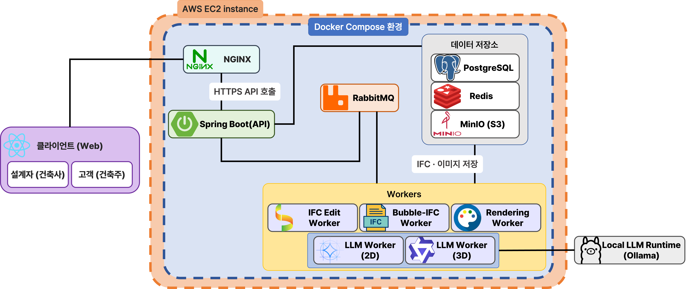

# BATANG

> 설계자와 고객이 편리하게 소통하며 반복되는 건축 설계 단계를 줄여주는 협업 BIM 플랫폼.

> 버블 다이어그램 → 2D 평면도 → 3D 모델 → 포토리얼 렌더 → IFC export 의 전 과정을 한 서비스에서 실시간 동기화·자연어 편집·핀 코멘트로 연결한다.

[](.gitlab-ci.yml)
[](BE/build.gradle)
[](FE/package.json)
[](AI/pyproject.toml)

---

## 목차

1. [프로젝트 소개](#1-프로젝트-소개)
2. [주요 기능](#2-주요-기능-features)
3. [기술 스택](#3-기술-스택-tech-stack)
4. [프로젝트 구조](#4-프로젝트-구조-project-structure)
5. [설치 및 시작 가이드](#5-설치-및-시작-가이드-installation--usage)
6. [서비스 화면](#6-서비스-화면)
7. [시스템 아키텍처](#7-시스템-아키텍처)
8. [사용자 시나리오 & 페르소나](#8-사용자-시나리오--페르소나)
9. [기존 서비스와의 차별점](#9-기존-서비스와의-차별점)
10. [구현 현황](#10-구현-현황)
11. [확장성](#11-확장성)
12. [목적·필요성·기대효과](#12-목적필요성기대효과)
13. [팀](#13-팀)

---

## 1. 프로젝트 소개

자세한 기획은 [[기획서|Home/기획서]]에서 확인 부탁드립니다.

### 해결하려는 문제

건축 설계 과정에서 설계자와 건축주 사이의 **반복적인 피드백 사이클** 이 과도한 시간·비용을 발생시킨다.

| 주체 | 문제 |
| :--- | :--- |
| 설계자 | 고객 요청이 바뀔 때마다 도면을 처음부터 다시 설계해야 한다. 피드백이 카톡·전화로 파편화되어 무엇이 반영됐는지 추적 불가. |
| 건축주 | 2D 도면만으로 완성된 공간을 상상하기 어렵고, 피드백이 전해졌는지 / 반영됐는지 확인할 방법이 없다. |

**시장 데이터**

- **McKinsey & Company**: 대형 건설 프로젝트의 **98% 가 예산 초과**, 평균 80% 이상 비용 증가. 핵심 원인은 파편화된 정보와 실시간 가시성 부족.
- **IntoAEC**: 툴 간 연결 부재로 인한 소통 지연이 미국 상업용 건축에서만 **10~15% 의 예산 초과** 를 유발.

### 솔루션

설계자와 클라이언트가 실시간으로 소통하며 빠르게 설계를 수정할 수 있는 웹 서비스. **버블 다이어그램 → 2D → 3D → AI 렌더링** 을 단일 플랫폼에서 연결해 도구 간 단절을 제거한다.

- **단계 자동 연동**: 한 단계 수정이 다른 단계로 자동 반영 — 처음부터 다시 그리는 비효율 제거
- **공간 기반 피드백**: 도면·모델 위에 핀과 댓글로 즉시 소통 — 카톡/전화 없이 사이클 완결
- **AI 렌더링**: 2D·3D 만으로는 가늠하기 어려운 완성된 공간을 실제 사진처럼 미리 확인
- **자연어 LLM 편집**: 채팅 한 줄로 IFC 모델 수정 — 비전문가도 의사 전달 가능
- **IFC 인계**: 작업물을 IFC 2x3 으로 export → Revit 등 외부 BIM 도구로 매끄럽게 전환

---

## 2. 주요 기능 (Features)

### 프로젝트 관리
- 프로젝트 생성 / 수정 / 검색 / 다중 soft delete
- 부지(지번) 등록 — PNU · 주소 · GIS 폴리곤
- 협업 멤버 초대 (email lookup) + 강퇴 (owner 전용)

### 협업 / 알림
- 프로젝트 초대 알림 inbox (`is_read` 필터)
- **SSE 실시간 알림 스트림** (사용자 단일 채널, keep-alive)
- 알림 본문은 초대 시점 스냅샷 — 원본 변경에 영향 없음

### 워크스페이스
- Redis 캐시된 최신 스냅샷 일괄 복원 (재방문 시 끊긴 작업 재개)
- Phase 자동 라우팅 (`BUBBLE_DRAFT` / `CONVERTING` / `IFC_EDIT`)
- IFC 파일 S3 presigned URL 다운로드

### 버블 다이어그램 / 2D / 3D 편집
- **STOMP 실시간 draft 동기화** — 같은 프로젝트 다중 세션
- 버블 / 2D / 3D undo · redo · 명시적 저장
- 명령 envelope 접수 (구조화된 작업 의도)

### AI 자동화
- **평면도 자동 생성** — 버블 → 평면도 비동기 변환 잡
- **IFC 자연어 편집** 4 경로 — 채팅 명령 / 2D LLM / 3D LLM / direct 페이로드
- **포토리얼 렌더링** — SD + ControlNet soft_lock + H-3 Real-ESRGAN x4 업스케일
- IFC 색 fingerprint 로 style profile 자동 해석

### 핀 협업
- IFC 뷰어 위 핀 — **카메라 + 월드 좌표** 함께 저장 (클릭 시 시점 복원)
- 핀 단위 / 댓글 단위 RESOLVED 처리 (독립적)
- `@Version` 낙관적 락으로 동시 수정 충돌 차단
- 핀 / 댓글 읽음 추적 (composite PK 테이블)

### 운영 / 안정성
- 전역 통일 에러 응답 (`ErrorResponse { status, code, message }`)
- 동시 active IFC 편집 잡 1개 강제 (`uq_jobs_project_active_ifc_edit`)
- `idempotency_key` 로 큐 메시지 재전송 중복 처리 차단
- Soft delete 패턴 (`deleted_at`) 으로 데이터 보존

전체 기능 명세는 [[기능 명세서|Home/기능-명세서]]에서 확인 부탁드립니다.

---

## 3. 기술 스택 (Tech Stack)

### Frontend


### Backend


### AI / Worker


### Infra / DevOps


---

## 4. 프로젝트 구조 (Project Structure)

```
S14P31A204/
├── FE/                              React + Vite + TypeScript 프론트엔드
│   ├── src/                         앱 소스 (컴포넌트 / 스토어 / 라우팅 / IFC 뷰어)
│   ├── public/                      정적 자산
│   ├── eslint.config.js             ESLint flat config
│   ├── package.json                 의존성 + npm scripts (dev / build / test / lint)
│   └── vite.config.ts               Vite 설정
│
├── BE/                              Spring Boot 3.5 (Java 21) 백엔드
│   ├── src/main/java/com/a204/batang/
│   │   ├── domain/                  도메인별 패키지 (auth / project / workspace / pin / ...)
│   │   │   └── {domain}/
│   │   │       ├── controller/      REST + STOMP 컨트롤러
│   │   │       ├── service/         비즈니스 로직
│   │   │       ├── repository/      JPA Repository
│   │   │       ├── entity/          JPA 엔티티
│   │   │       └── dto/             Request / Response DTO
│   │   ├── global/                  공통 인프라 (exception / config / common entity)
│   │   └── BatangApplication.java   진입점
│   ├── src/test/                    JUnit 5 테스트
│   ├── build.gradle                 Gradle + Spring Boot 의존성
│   └── Dockerfile
│
├── AI/                              Python 3.11 uv workspace
│   ├── packages/                    9 개 workspace 패키지
│   │   ├── ai-common/                   공통 유틸 / 타입
│   │   ├── ai-domain/                   도메인 모델
│   │   ├── ai-layout-import/            버블 → 평면 layout 변환
│   │   ├── ai-planning/                 평면 계획 공통
│   │   ├── ai-planning-2d/              2D 평면 계획
│   │   ├── ai-planning-3d/              3D 평면 계획
│   │   ├── ai-authoring/                IFC authoring
│   │   ├── ai-rendering/                SD + ControlNet + soft_lock + H-3
│   │   └── ai-evals/                    평가 / 메트릭
│   ├── scripts/                     실행 스크립트 (production pipeline / E2E verify 등)
│   ├── tests/                       워크스페이스 통합 테스트
│   ├── outputs/                     산출물 (git ignored)
│   └── pyproject.toml               uv workspace + Ruff + pytest 설정
│
├── INFRA/                           docker-compose / 배포 스크립트
│   ├── docker-compose.yml           로컬 인프라 (PostgreSQL · Redis · MinIO · RabbitMQ)
│   └── scripts/                     deploy-staging.sh 등
│
├── shared/                          FE/BE/AI 공유 contract (스키마·상수)
│
├── .gitlab-ci.yml                   CI 파이프라인 정의 (prepare → lint → test → build → deploy)
├── README.md                        프로젝트 개요 (이 파일)
├── USER_SCENARIOS.md                사용자 시나리오
├── GIT_CONVENTIONS.md               Git Flow · 브랜치 / 커밋 / PR 컨벤션
├── CODE_CONVENTIONS.md              CI 강제 코드 컨벤션
└── BE/                              (백엔드 문서 4종)
    ├── REQUIREMENTS_SPEC.md         기획 요구사항
    ├── FEATURE_SPEC.md              구현 기능 명세
    ├── API_SPEC.md                  REST + STOMP 엔드포인트
    └── ERD_TABLES.md                DB 테이블 정의
```

---

## 5. 설치 및 시작 가이드 (Installation & Usage)

### 필수 요구사항

| 도구 | 버전 | 용도 |
| :--- | :--- | :--- |
| **Java** | 21 | BE 컴파일 / 실행 (Gradle toolchain 자동 다운로드 가능) |
| **Node.js** | 20 | FE 빌드 / 실행 |
| **Python** | 3.11 | AI 워크스페이스 |
| **uv** | 최신 | Python 의존성 관리 ([설치](https://docs.astral.sh/uv/getting-started/installation/)) |
| **Docker** + Compose | 최신 | 로컬 인프라 (PostgreSQL · Redis · MinIO · RabbitMQ) |
| **NVIDIA GPU + CUDA 12.6** | (선택) | AI 렌더링 (Stable Diffusion + Real-ESRGAN) 실행 시 |

### 로컬 인프라 띄우기

```bash
cd INFRA
docker compose up -d           # PostgreSQL · Redis · MinIO · RabbitMQ 일괄 기동
```

환경 변수는 각 영역의 `.env.example` 또는 docker-compose 의 `environment` 섹션 참고.

### Frontend 설치 · 실행

```bash
cd FE
npm ci                         # 의존성 설치 (lockfile 기준 정확 재현)
npm run dev                    # 개발 서버 (Vite HMR)
# 또는
npm run build && npm run preview   # 프로덕션 빌드 + 미리보기
```

| 명령어 | 동작 |
| :--- | :--- |
| `npm run dev` | Vite 개발 서버 |
| `npm run lint` | `eslint . && tsc -b --noEmit` |
| `npm run test` | Vitest |
| `npm run build` | `tsc -b && vite build` |
| `npm run preview` | 빌드 산출물 미리보기 |

### Backend 설치 · 실행

```bash
cd BE
./gradlew bootRun              # 개발 실행 (Spring Boot devtools)
# 또는
./gradlew bootJar              # 패키징
java -jar build/libs/*.jar     # 실행
```

| 명령어 | 동작 |
| :--- | :--- |
| `./gradlew bootRun` | 개발 서버 (자동 리로드) |
| `./gradlew test` | JUnit 5 전체 테스트 |
| `./gradlew bootJar` | 실행 가능한 jar 패키징 |
| `./gradlew clean build` | 클린 후 전체 빌드 |

### AI 설치 · 실행

```bash
cd AI
uv sync --group test                                       # 의존성 설치 (test 그룹 포함)
uv run pytest                                              # 전체 테스트
uvx ruff check .                                           # 린트
uv run python scripts/run_shinchan_production_pipeline.py  # production 렌더 파이프라인 실행
```

| 명령어 | 동작 |
| :--- | :--- |
| `uv sync` | `uv.lock` 기준 의존성 설치 |
| `uv sync --group test` | + 테스트 의존성 (pytest 등) |
| `uvx ruff check .` | 캐시 없이 즉시 Ruff 실행 |
| `uv run pytest` | 워크스페이스 전체 테스트 |
| `uv run python <script>` | 워크스페이스 가상환경에서 스크립트 실행 |

### 전체 통합 실행

1. `cd INFRA && docker compose up -d` — 인프라 기동
2. `cd BE && ./gradlew bootRun` — 백엔드 8080 포트
3. `cd FE && npm run dev` — 프론트엔드 5173 포트
4. (필요 시) `cd AI && uv run python -m ai_worker_entry` — AI 워커 (큐 컨슈머)
5. 브라우저에서 `http://localhost:5173` 접속

---

## 6. 서비스 화면

| # | 화면 | 설명 |
| :---: | :--- | :--- |
| 01 |  | **랜딩 페이지** — 버블·2D·3D·렌더링 단계를 한눈에 보여주는 서비스 소개 + 로그인 진입 |
| 02 |  | **로그인** — 이메일·비밀번호로 BATANG 계정 인증 |
| 03 |  | **회원가입** — 디자이너 / 고객 역할 선택 + 이메일 인증 코드 |
| 04 |  | **프로젝트 대시보드** — 내 프로젝트 목록 · 검색 · 새 프로젝트 생성 진입 |
| 05 |  | **알림 inbox** — SSE 로 푸시되는 안 읽은 댓글 / 초대 알림 목록 |
| 06 |  | **프로필** — 사용자 정보 · 역할 · 로그아웃 · 회원탈퇴 |
| 07 |  | **새 프로젝트 생성** — 프로젝트 이름 · 설명 입력 |
| 08 |  | **대지 입력 (주소 검색)** — 지도에서 부지 주소 검색 |
| 09 |  | **대지 입력 (폴리곤)** — GIS 폴리곤 선택 + 대지 면적 자동 계산 |
| 10 |  | **버블 다이어그램 편집** — 공간(거실·주방·침실) 배치 + 인스펙터 / 층 보기 |
| 11 |  | **공유 초대** — 이메일로 협업자(CUSTOMER) 초대 발송 |
| 12 |  | **2D 평면도 편집** — AI 자동 변환된 평면 결과 편집 |
| 13 |  | **3D 편집 모드** — IFC 모델 편집 + 계층 구조 인스펙터 + 뷰어 모드 전환 |
| 14 |  | **뷰어 모드 / AI 렌더링** — 시간대·계절 선택 후 포토리얼 렌더 + IFC 내보내기 |

---

## 7. 시스템 아키텍처



| 채널 | 용도 |
| :--- | :--- |
| **REST** | 인증·CRUD·잡 등록 동기 호출 |
| **AMQP (RabbitMQ)** | BE → AI 워커 비동기 잡 디스패치 |
| **Webhook** | AI 워커 → BE 완료 콜백 |
| **STOMP (WebSocket)** | 협업 실시간 채널 — 버블·2D·3D draft, 핀·댓글 |
| **SSE** | 사용자별 알림 단방향 스트림 |

| 저장소 | 용도 |
| :--- | :--- |
| **PostgreSQL** | 영속 데이터 (사용자·프로젝트·핀·잡·산출물 메타) |
| **Redis** | 워크스페이스 임시 상태 (버블·평면도 draft 캐시) |
| **S3 / MinIO** | IFC·렌더 이미지 등 산출물 파일 |

---

## 8. 사용자 시나리오 & 페르소나

### 사용자 플로우 요약

**설계자**
```
[초기 설계]    프로젝트 생성 → 버블 다이어그램 → 자동 배치 → 2D 평면도 변환
              → 자연어로 평면 수정 → 3D 변환 → 가구·마감재 → AI 렌더링 → 건축주 초대

[피드백 반영]  코멘트 알림 → 핀 위치 자동 이동 → 수정 후 체크 → 반영 알림 발송

[설계 확정]    IFC Export → Revit 인계
```

**건축주**
```
[초안 확인]    초대 알림 → 링크로 3D 뷰어 → 층 전환·치수 확인

[피드백 제출]  핀 코멘트 작성 → 반영 알림 → 재접속 → Before/After 확인
```

자세한 사용자 시나리오는 [[사용자 시나리오|Home/사용자-시나리오]]에서 확인 부탁드립니다.

---

## 9. 기존 서비스와의 차별점

| 구분 | 기존 (Revit, AutoCAD 등) | BATANG | 차별점 |
| :--- | :--- | :--- | :--- |
| **작업 흐름** | 선형 / 단절적 — 2D 완성 후 별도 3D 렌더 | 유기적 연결 — 버블 ↔ 2D ↔ 3D 실시간 동기화 | 수정 시 하위 단계 재작업 불필요, 리드타임 단축 |
| **수정 방식** | 수동 재설계 — 파라미터·선 일일이 수정 | LLM 채팅 기반 — 대화형 즉각 수정 | 비전문가도 직관적 의사 전달, 즉시 반영 확인 |
| **소통 환경** | 오프라인 / 비동기 — 도면 전달 → 검토 → 미팅 → 재수정 (수일) | 실시간 — 도면 내 핀 코멘트 + STOMP 동기화 | 피드백 루프 단축, 의사결정 지연 비용 방지 |
| **사용자 타겟** | 전문가 중심 — 높은 학습 곡선, 고사양 HW | 협업 중심 — 설계자·고객 모두를 위한 웹 | 건축 지식 부족으로 인한 오해를 3D 시각화로 해소 |

---

## 10. 구현 현황


### 도메인별 기능 매트릭스

| 도메인 | 기능 수 | 핵심 |
| :--- | :--- | :--- |
| 인증·계정 (AUTH) | 8 | 이메일 인증 + JWT + 토큰 rotation |
| 프로젝트 (PRJ) | 7 | 생성·수정·검색·삭제·부지 등록 |
| 협업·알림 (COL) | 6 | email 초대 + SSE 스트림 |
| 워크스페이스 (WS) | 3 | Redis 스냅샷 + IFC presigned export |
| 버블 (BUB) | 3 | STOMP draft 동기화 + 저장 |
| 평면도 (FP) | 3 | 비동기 잡 + AI 워커 webhook |
| 2D/3D 편집 (FE) | 4 | draft 동기화 + 저장 + 명령 envelope |
| IFC 편집 (IFC) | 6 | 채팅 / direct / 2D LLM / 3D LLM 4 경로, 동시 active 1 강제 |
| 렌더링 (RND) | 3 | SD + ControlNet soft_lock + H-3 Real-ESRGAN |
| 핀 (PIN) | 6 | 카메라/월드 좌표 + `@Version` 낙관적 락 |
| 핀 댓글 (CMT) | 6 | 댓글 단위 resolve + 비정규화 갱신 |
| 운영 (OPS) | 5 | 통일 에러 + 동시성 제약 + STOMP 에러 라우팅 |

---

## 11. 확장성

### 기능 확장
- **건물 유형**: 단독주택 → 공동주택 → 소형 상업시설 → 인테리어 리모델링
- **AI 기능**: 외관 렌더 → 실내 렌더 + 채광 시뮬레이션 + 에너지 효율 분석
- **자연어 편집 범위**: 2D 평면 수정 → 버블 + 3D + 마감재 일괄 변경 전 단계
- **비용 연동**: 설계 변경 시 자재비·공사비 자동 산출 → 예산 관리 지원

### 시장 확장
- **B2C**: 설계자 중심 B2B → 건축주 직접 초안 + 설계자 매칭 B2C
- **해외**: IFC 표준 기반이라 글로벌 BIM 생태계 호환
- **인테리어**: 시공 전 시뮬레이션 도구로 확장

### 연동 확장
- **BIM 소프트웨어**: Revit → ArchiCAD · Rhino 직접 연동
- **시공 관리**: 공정 관리 + 자재 발주 시스템 → 설계부터 준공까지 단일 흐름
- **부동산·금융**: 건축 대출 심사 / 감정평가 자료 자동 제출

---

## 12. 목적·필요성·기대효과

### 서비스 목적
건축 설계 과정에서 설계자와 건축주 사이에 반복되는 수정 사이클을 줄이고, 양측이 **동일한 시각적 맥락 위에서 실시간으로 소통** 할 수 있는 협업 환경을 제공한다. 설계 전 단계를 하나의 플랫폼에서 연결해 도구 간 단절로 인한 비효율을 제거한다.

### 서비스 필요성
건축 설계는 구조적으로 수정이 잦다. 건축주의 요청 하나가 버블·2D·3D 각 단계를 처음부터 다시 작업하게 만들고, 피드백은 전화·카톡으로 파편화되어 추적이 어렵다. 건축주는 2D 도면만으로 완성된 공간을 상상하기 어려워 뒤늦게 의견이 바뀌고, 이것이 다시 수정 사이클을 늘린다. McKinsey 의 "대형 건설 98% 예산 초과", IntoAEC 의 "소통 단절로 10~15% 초과" 통계가 보여주듯 도구의 문제가 곧 비용의 문제다.

### 기대효과

| 대상 | 기대효과 |
| :--- | :--- |
| **설계자** | 단계 자동 연동으로 재작업 범위 감소. 피드백이 핀 코멘트로 일원화되어 누락 없이 추적 가능 |
| **건축주** | AI 렌더링으로 완성된 공간을 사전 확인 → 뒤늦은 변경 요청 감소. 링크 하나로 언제든 3D 모델 접근 + 직접 피드백 |
| **프로젝트 전체** | 수정 사이클 단축으로 설계 기간·비용 절감. IFC 인계로 Revit 실시설계 단계까지 끊김 없이 연결 |

---

## 13. 팀

SSAFY 14기 자율 PJT — **A204 BATANG 팀**

| 이름   | 역할           | 이메일                  |
| :----- | :------------- | :---------------------- |
| 김나연 | AI / Backend / 팀장 | mandubong1206@gmail.com |
| 김태영 | Frontend | okaysky11@gmail.com |
| 박동한 | AI / Backend / Infra / Frontend | vkfkdtor00@gmail.com |
| 박연준 | Backend        | hnn06134@gmail.com |
| 변희연 | AI / Project Manager | pbhy@naver.com |
| 양대천 | AI | bigskyyang@gmail.com |
| 오지수 | Frontend / Backend / PD | ohjisu320@gmail.com |
