# 시연 시나리오

## 랜딩 페이지
랜딩 페이지에서 BATANG에 대한 소개를 확인할 수 있습니다.
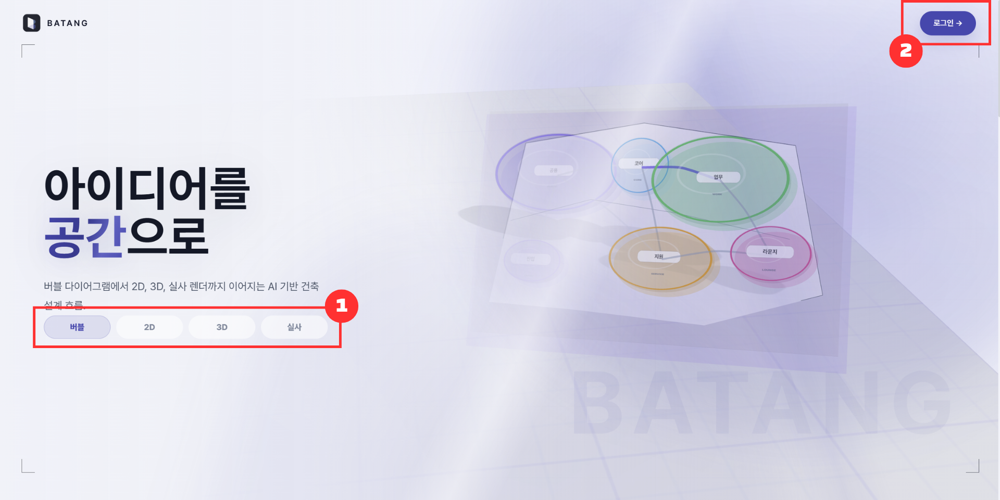

### 1. BATANG 소개
버블 다이어그램, 2D 도면, 3D 모델링, 렌더링 실제 사진까지 저희가 제공하는 서비스들을 그림으로 확인할 수 있습니다.

### 2. 로그인 버튼
로그인 버튼을 눌러 로그인 페이지로 이동할 수 있습니다.

## 로그인 페이지
가입한 사용자는 로그인 페이지에서 로그인을 할 수 있습니다.
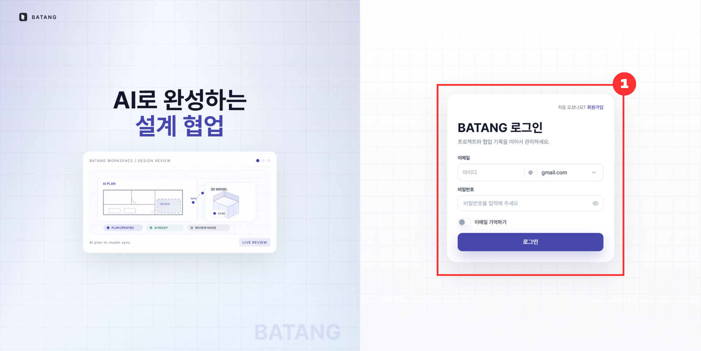

## 회원가입 페이지
가입하지 않은 사용자는 회원가입 페이지에서 회원가입을 할 수 있습니다.
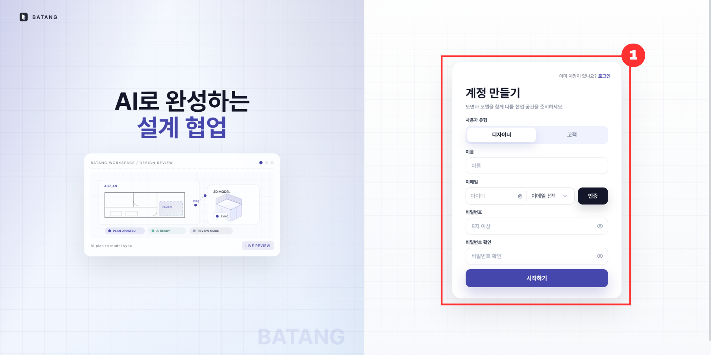

### 1. 회원가입 모달
건축가인 경우, 디자이너를, 클라이언트인 경우, 고객을 선택하여 회원가입 할 수 있습니다.
이름, 이메일, 비밀번호를 입력하여 회원가입을 진행할 수 있습니다.

## 프로젝트 페이지
프로젝트 페이지에서 내 프로젝트들을 확인할 수 있습니다.
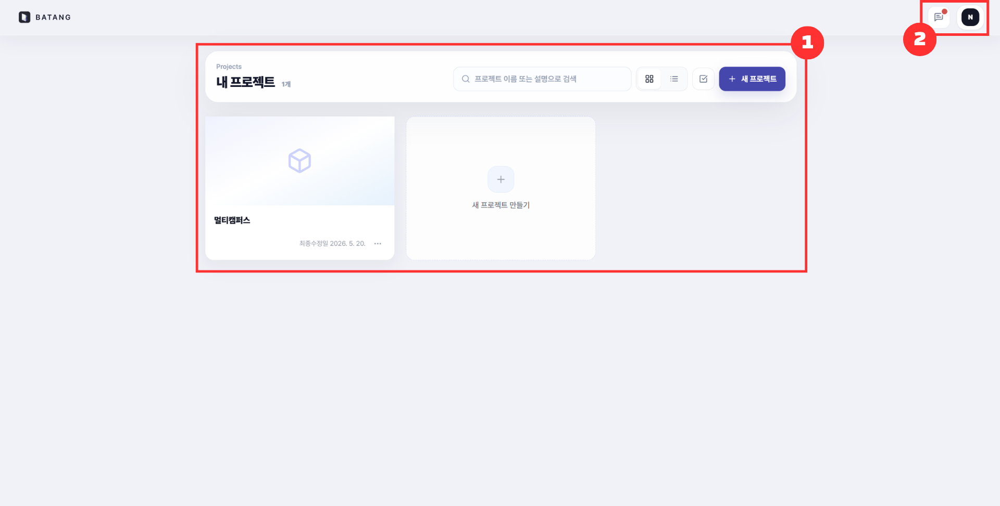

### 1. 프로젝트 조회 / 생성 / 삭제
프로젝트 목록 및 프로젝트 조회를 할 수 있습니다. 새 프로젝트 버튼을 클릭하여 새 프로젝트를 생성할 수 있습니다. 프로젝트를 클릭하여 프로젝트에 진입할 수 있으며, 삭제 또한 할 수 있습니다.

#### 1-1. 새 프로젝트
새 프로젝트 버튼을 클릭하여, 새 프로젝트를 생성할 수 있습니다. 프로젝트 이름, 설명을 추가할 수 있으며, 이름은 필수입니다.
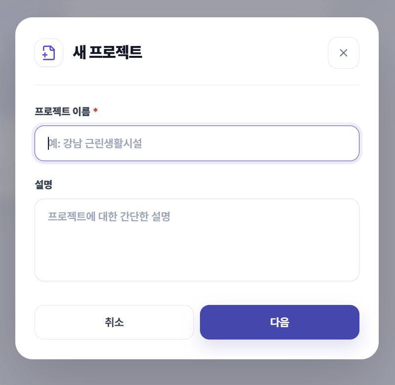

#### 1-2. 대지 입력 모달
프로젝트 진행 전, 건축 설계에 필요한 대지 정보를 불러오는 모달입니다. 주소 검색을 통해 대지 정보를 불러올 수 있습니다.
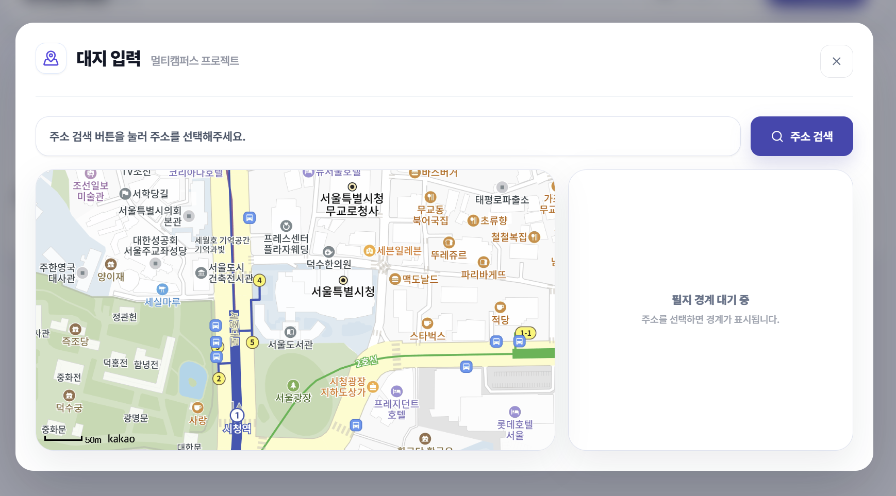

#### 1-3. 대지 입력 완료 모달
대지를 선택하고 나면, 대지 정보와 평수, 면적을 확인할 수 있습니다. 프로젝트 생성 버튼을 클릭하여 프로젝트를 시작할 수 있습니다.
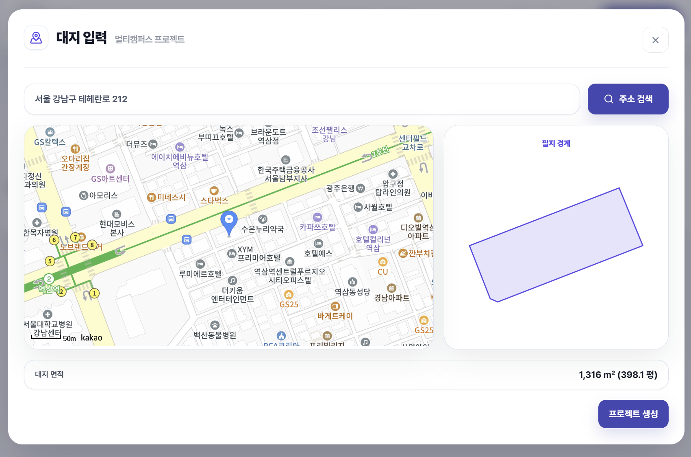

### 2. 알림 및 내 정보
알림 및 내 정보를 확인할 수 있는 버튼들입니다.

#### 2-1. 알림 모달
프로젝트 들에 달린 댓글, 초대 알림 등 알림들을 확인할 수 있는 모달입니다.
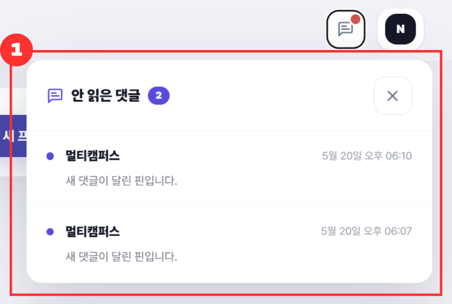

#### 2-2. 내 정보 모달
내 이름, 메일 등을 확인할 수 있는 모달입니다. 로그아웃 버튼으로 로그아웃이 가능합니다. 회원탈퇴 버튼으로 회원탈퇴가 가능합니다.
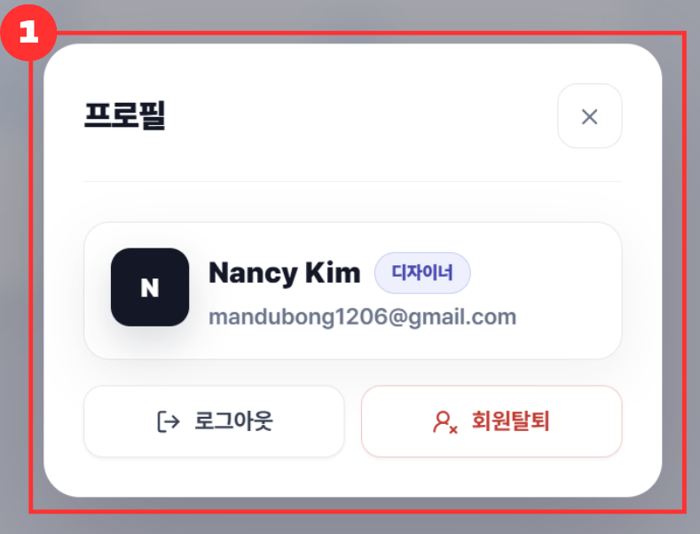

## 버블 다이어그램 페이지
버블 다이어그램을 생성, 수정, 삭제할 수 있는 페이지입니다.
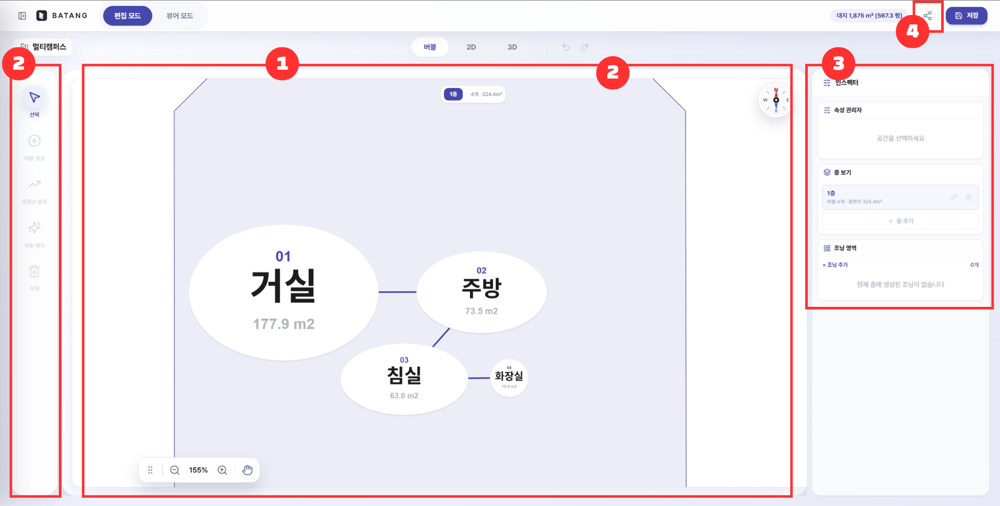

### 1. 버블 다이어그램 조회
생성하고 수정한 버블 다이어그램을 확인할 수 있는 영역입니다. 드래그, 클릭, 단축키 등으로 수정을 진행할 수 있습니다.

### 2. 버블 다이어그램 편집 툴
다른 편집 서비스의 툴과 같이 클릭, 버블 다이어그램 생성, 연결 선 생성, 자동 배치, 삭제가 가능한 편집 툴입니다.

### 3. 인스펙터 영역
속성 관리자, 층 보기, 조닝 영역 등 버블 다이어그램에 필요한 정보들을 추가로 제공하는 영역입니다.

### 4. 공유 버튼
공유 버튼을 클릭하여 클라이언트를 초대할 수 있습니다.

#### 4-1. 초대 모달
초대 모달에 이메일 주소를 입력하여 클라이언트를 초대할 수 있습니다.  

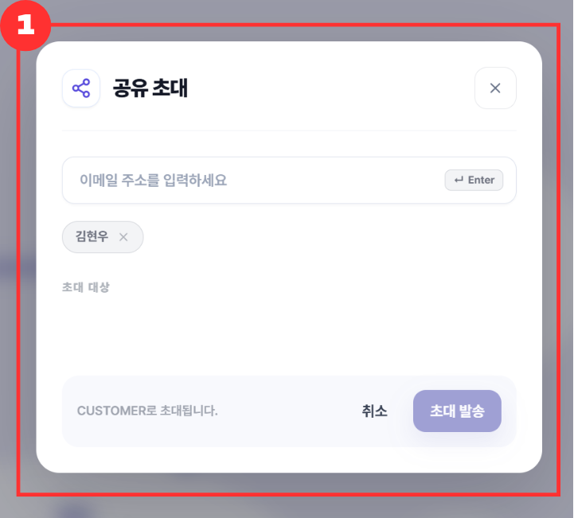

### 2D 도면 페이지
생성하고 수정한 2D 도면을 확인할 수 있는 영역입니다. 드래그, 클릭, 단축키 등으로 수정을 진행할 수 있습니다.
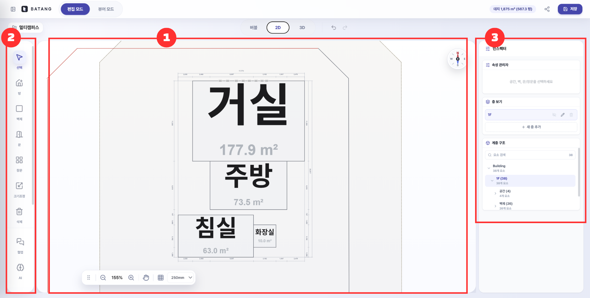

### 1. 2D 도면 조회
생성하고 수정한 2D 도면을 확인할 수 있는 영역입니다. 드래그, 클릭, 단축키 등으로 수정을 진행할 수 있습니다

### 2. 2D 도면 편집 툴
다른 편집 서비스의 툴과 같이 클릭, 방, 벽, 창문 추가, 삭제가 가능한 편집 툴입니다. 협업 버튼을 활용해, 달린 댓글들을 확인할 수 있으며, AI 버튼을 클릭해, LLM 채팅으로 2D 도면을 수정할 수 있습니다.

### 3. 인스펙터 영역
속성 관리자, 층 보기, 계층 구조 등 2D 도면에 필요한 정보들을 추가로 제공하는 영역입니다. 협업 버튼을 클릭 시, 달린 댓글들을 확인할 수 있으며, AI 버튼을 클릭 시, LLM 채팅으로 수정을 진행할 수 있습니다.

### 3D 모델링 페이지
생성하고 수정한 3D 모델링을 확인할 수 있는 영역입니다. 드래그, 클릭, 단축키 등으로 수정을 진행할 수 있습니다.
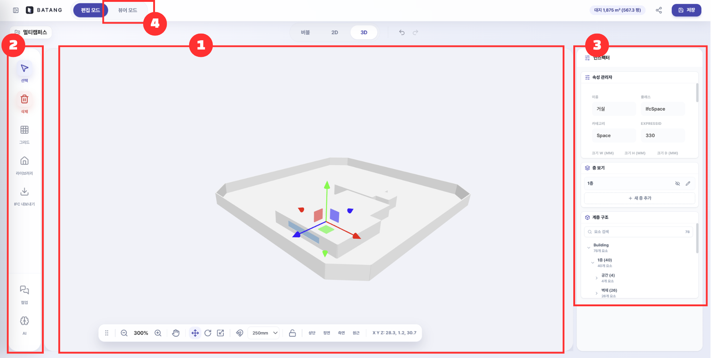

### 1. 3D 모델링 조회
생성하고 수정한 3D 모델링을 확인할 수 있는 영역입니다. 드래그, 클릭, 단축키 등으로 수정을 진행할 수 있습니다

### 2. 3D 모델링 편집 툴
다른 편집 서비스의 툴과 같이 클릭, 라이브러리를 활용한 벽, 창문, 벽 등 추가, 삭제가 가능한 편집 툴입니다. 협업 버튼을 활용해, 달린 댓글들을 확인할 수 있으며, AI 버튼을 클릭해, LLM 채팅으로 2D 도면을 수정할 수 있습니다.

### 3. 인스펙터 영역
속성 관리자, 층 보기, 계층 구조 등 3D 모델링에 필요한 정보들을 추가로 제공하는 영역입니다. 각 요소를 클릭 시, 각 요소의 색, 재질, 크기 등을 수정할 수 있습니다. 협업 버튼을 클릭 시, 달린 댓글들을 확인할 수 있으며, AI 버튼을 클릭 시, LLM 채팅으로 수정을 진행할 수 있습니다.

## 조감도 페이지
3D 모델링과 2D 도면을 기준으로 실제 사진처럼 렌더링 된 사진을 확인할 수 있는 페이지 입니다.
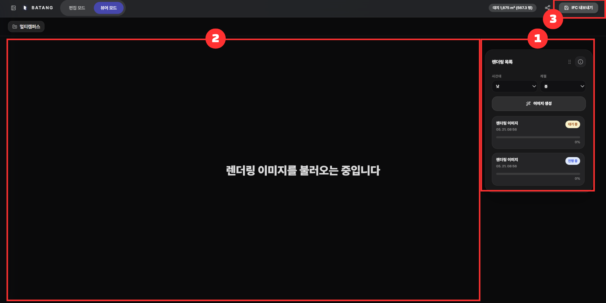

### 1. 렌더링 정보
실제 사진 생성 시, 필요한 정보를 입력하고 생성할 수 있습니다. 낮 / 밤을 클릭하여 사진을 생성할 수 있습니다.

### 2. 렌더링 이미지 조회
생성된 사진을 확인할 수 있습니다.

### 3. ifc 내보내기 버튼
버튼을 클릭하여, 다른 건축 툴에서 작업이 필요한 경우, 건축 설계에 기준인 ifc 파일로 내보내기가 가능합니다.